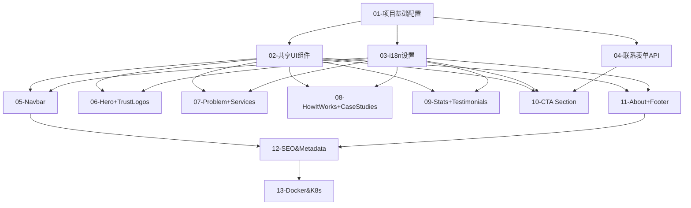

# DreamWise AI 官网 — 开发模块规划

## 项目概述

DreamWise AI 官网，单页 Landing Page，Next.js 14，K8s 自托管部署。目标：上线后成为 $1M ARR 的获客入口。

## 技术栈

| 层级 | 技术选型 |
|------|----------|
| 前端框架 | Next.js 14 (App Router, standalone) |
| 样式 | Tailwind CSS |
| 动效 | Framer Motion |
| 国际化 | next-intl (zh/en) |
| 图标 | Lucide React |
| 字体 | Sora + Inter (next/font) |
| 邮件 | Resend API |
| 预约 | Calendly inline widget |
| 容器 | Docker (standalone mode) |
| 编排 | Kubernetes (k3s) |

## 开发模块总览

| # | 模块名称 | 类型 | 优先级 | 预估工时 | 状态 |
|---|---------|------|--------|----------|------|
| 01 | 项目基础配置 | Foundation | P0 | 2h | 待开发 |
| 02 | 共享 UI 组件 | Foundation | P0 | 3h | 待开发 |
| 03 | i18n 多语言设置 | Foundation | P0 | 2h | 待开发 |
| 04 | 联系表单 API | Backend | P0 | 2h | 待开发 |
| 05 | Navbar | Frontend | P0 | 3h | 待开发 |
| 06 | Hero + Trust Logos | Frontend | P0 | 4h | 待开发 |
| 07 | Problem + Services | Frontend | P0 | 4h | 待开发 |
| 08 | How It Works + Case Studies | Frontend | P1 | 4h | 待开发 |
| 09 | Stats + Testimonials | Frontend | P1 | 3h | 待开发 |
| 10 | CTA Section (Calendly + 表单) | Frontend | P0 | 4h | 待开发 |
| 11 | About + Footer | Frontend | P1 | 3h | 待开发 |
| 12 | SEO & Metadata | Frontend | P0 | 2h | 待开发 |
| 13 | Docker & K8s 配置 | Infrastructure | P0 | 3h | 待开发 |

**总预估工时**：约 39 小时（约 5 个工作日）

## 模块依赖关系



## 开发流程

```
Phase 1: Foundation（模块 01-03）
  ├── 01: Next.js 配置 + standalone 模式 + Tailwind + 字体
  ├── 02: 共享组件（Button/Card/AnimatedSection）
  └── 03: next-intl 设置 + 翻译文件

Phase 2: Backend（模块 04）
  └── 04: /api/contact Route Handler + Resend 集成

Phase 3: Frontend Sections（模块 05-11）
  ├── 05: Navbar（先做，其他 Section 依赖布局）
  ├── 06: Hero + Trust Logos（首屏，最重要）
  ├── 07: Problem + Services
  ├── 08: How It Works + Case Studies
  ├── 09: Stats + Testimonials
  ├── 10: CTA（核心转化，优先）
  └── 11: About + Footer

Phase 4: 上线准备（模块 12-13）
  ├── 12: SEO Metadata + og:image
  └── 13: Dockerfile + K8s manifests
```
